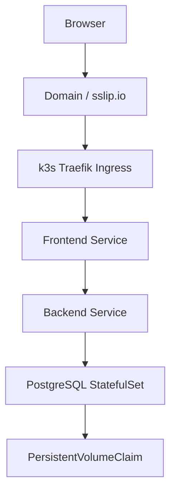

# Architecture

## Request Flow

1. Browser requests `http://HOST/`.
2. Traefik Ingress routes traffic to the frontend service.
3. Nginx serves static assets and proxies `/api/*` to the backend service.
4. Backend reads/writes PostgreSQL through the cluster-internal service.
5. PostgreSQL persists data on a PVC provisioned by k3s local-path storage.

