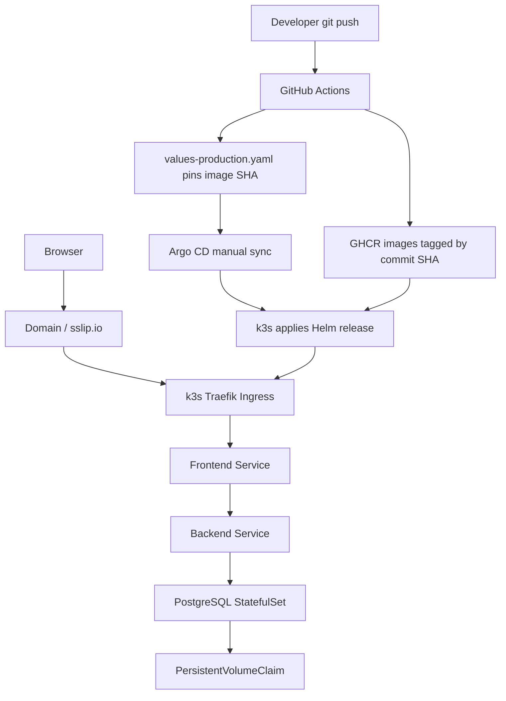

# Architecture

## Request Flow

1. Browser requests `http://HOST/`.
2. Traefik Ingress routes traffic to the frontend service.
3. Nginx serves static assets and proxies `/api/*` to the backend service.
4. Backend reads/writes PostgreSQL through the cluster-internal service.
5. PostgreSQL persists data on a PVC provisioned by k3s local-path storage.

## Deployment Flow

1. GitHub Actions builds backend and frontend images after a push to `main`.
2. Images are pushed to GHCR with both `github.sha` and `latest` tags.
3. GitHub Actions updates `infra/helm/k3s-portfolio/values-production.yaml` with the built commit SHA.
4. Argo CD watches the Git repository and renders the Helm chart from `infra/helm/k3s-portfolio`.
5. The current release gate is manual sync in Argo CD.
6. After sync, k3s pulls the pinned GHCR images and Traefik exposes the app through Ingress.
