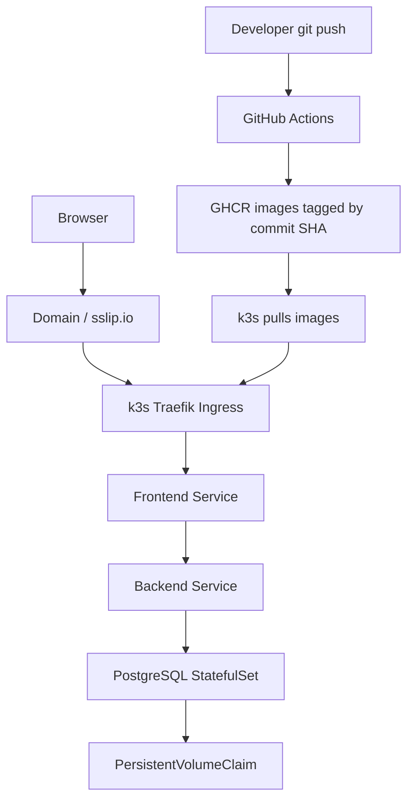

# Architecture

## Request Flow

1. Browser requests `http://HOST/`.
2. Traefik Ingress routes traffic to the frontend service.
3. Nginx serves static assets and proxies `/api/*` to the backend service.
4. Backend reads/writes PostgreSQL through the cluster-internal service.
5. PostgreSQL persists data on a PVC provisioned by k3s local-path storage.

## Deployment Flow

1. GitHub Actions builds backend and frontend images after a push to `main`.
2. Images are pushed to GHCR with both `github.sha` and `latest` tags.
3. Production deploys should pin `infra/helm/k3s-portfolio/values-production.yaml` to the commit SHA tag.
4. The current flow deploys manually with `helm upgrade`.
5. The next GitOps step is Argo CD watching Git and syncing the Helm chart into k3s.
